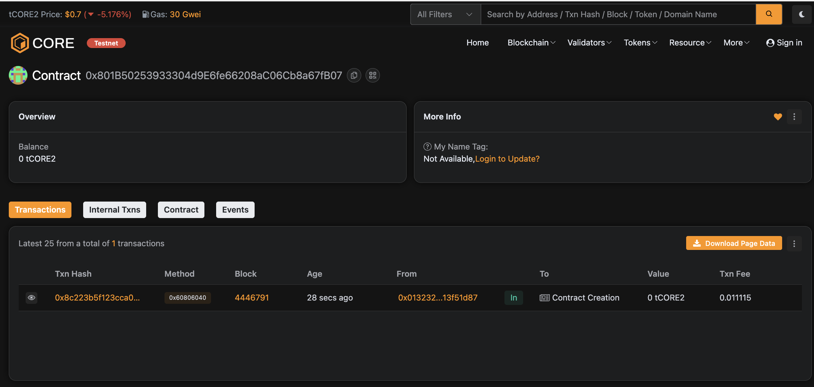

# Crowdfunding

## Project Description

The Crowdfunding project is a decentralized fundraising smart contract built with Solidity. It allows users to contribute funds toward a defined goal within a specific time period. If the goal is met by the deadline, the contract owner can withdraw the funds.

## Project Vision

Our vision is to empower individuals and communities to raise funds transparently and securely using blockchain technology. By eliminating intermediaries, this platform ensures that every contribution directly supports the intended cause.

## Key Features

- **Goal-Oriented Campaigns**: Define a fundraising target and deadline.
- **Secure Contributions**: Funds are stored securely until the goal is reached or time expires.
- **Owner Withdrawal**: Only the campaign creator can withdraw funds, and only when conditions are met.
- **Public Transparency**: Anyone can view the campaign summary including goal, amount raised, time left, and goal status.

## Future Scope

- Add support for multiple campaigns.
- Implement contributor refunds if the goal is not reached.
- Integrate with a frontend DApp using MetaMask.
- Build a leaderboard and contributor tracking system.
- Enable NFTs or badges for top contributors.

## Contract Details
0x801B50253933304d9E6fe66208aC06Cb8a67fB07

